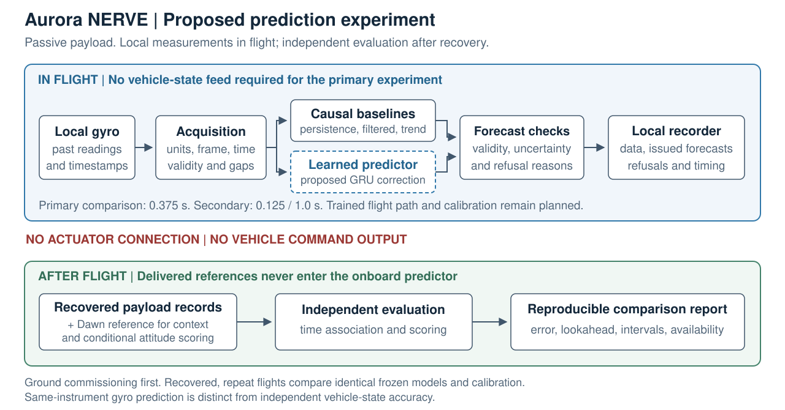

# Aurora NERVE — Learned Motion Prediction in Supersonic Flight

*A passive research payload proposed for the Dawn Aerospace Suborbital Spaceplane
Challenge, to fly aboard the Aurora spaceplane.*



> This is the public overview of Aurora NERVE. The research framework itself
> (simulation, world-model training, runtime assurance, recording and scoring
> software) is maintained privately. This repository tells the story of what we
> set out to do and shares the study design, architecture and a simulator demo.

---

## 1. The problem: learned models in fast flight need evidence, not promises

Machine-learned models are increasingly proposed for flight: to predict motion,
anticipate disturbances and, eventually, to support control. In high-speed flight
the conditions change quickly. Across subsonic, transonic and supersonic flight the
aerodynamics shift, vibration and sensor behaviour change, and a model trained in
one regime can be confidently wrong in the next.

Two questions decide whether such a model is ever worth integrating:

1. **Does it actually predict better** than the strong conventional methods
   engineers already use, rather than just better than a naive one?
2. **Does it know when not to be trusted?** A model that predicts well on average
   but fails silently in unfamiliar conditions is a liability. A model that refuses
   every hard case is useless.

Neither question can be answered on a bench or in a simulator alone. Simulators
reproduce the physics they were given, and benches do not fly. The answer needs
real high-speed flight, flown more than once, with the hardware recovered.

## 2. Why Aurora

Dawn Aerospace's Aurora is a reusable, runway-based suborbital spaceplane. It
reaches speeds up to **Mach 3.7** and altitudes approaching **100 km**. Its boost-glide
profile offers an extended high-speed window, and it is designed to fly again
within hours.

For this research, that combination is the point:

- **Real motion, real acquisition conditions.** Vibration, delays and regime
  changes come from actual flight, not from a model of it.
- **Recoverable hardware.** The full high-rate record comes home, so nothing has to
  squeeze through a narrow downlink.
- **Repeat flights.** A second flight with an *identical, frozen* configuration
  tests whether a result repeats. One-off sounding rockets and bespoke flight-test
  programmes rarely offer that.

Aurora turns "does this learned predictor transfer to real flight, and does it
transfer twice?" into an experiment that can actually be run.

## 3. What we proposed to fly

Aurora NERVE is a **passive payload that predicts its own motion and checks
itself afterwards.**

During flight, the payload records its own three-axis gyro and continuously
forecasts what that gyro will read **0.125 s, 0.375 s and 1 s ahead**. It runs
two kinds of predictor side by side:

- **Learned:** a compact recurrent (GRU) correction model and a regularized
  linear history model.
- **Conventional:** raw persistence, causally filtered constant rate and causal
  trend. The strongest of these is selected on development data before flight
  and becomes the bar to beat.

Every prediction, its uncertainty interval, any refusal to predict, and its issue
time are written to local storage **before the outcome exists**. In effect the
experiment is pre-registered tick by tick, so nothing can be fitted to the
answer after the fact.

After recovery, the recorded forecasts are scored against what the gyro actually
measured. Dawn's post-flight reference data (Mach, altitude, attitude and dynamic
pressure) places each result in the flight regime it came from. This shows where
learning added useful lookahead and where it did not.

**The primary result** is the paired per-flight difference in gyro vector RMSE at
0.375 s between the learned predictor and the strongest conventional one. Methods
are compared at matched prediction availability, so a system cannot look good by
refusing the hard moments.

**The campaign** is two to three boost-glide flights with models, preprocessing and
calibration frozen throughout. Ground commissioning comes first. Flight one tests
the integrated system, flight two measures repeatability, and a third adds
exposure if allocated. No special manoeuvre and no fixed supersonic duration are
required. Even a single flight still gives a valid within-flight comparison.

Full design: [docs/experiment.md](docs/experiment.md).

## 4. What it offers Dawn and Aurora's research customers

- **A demonstration of Aurora as a test bed for flight software and
  instrumentation.** It shows the repeat-flight evaluation workflow that research
  customers would use: integrate, fly, recover, compare, fly again unchanged.
- **Evidence that flight-test and instrumentation teams can act on.** The
  deliverable is a reproducible report of error, available lookahead,
  availability and uncertainty failures against conventional baselines. It
  includes the cases where simpler methods win.
- **A low-burden payload.** It is passive and closed-hatch, runs on vehicle bus
  power and records locally. It needs no live vehicle-state feed, no in-flight
  control, no pointing service and no special flight profile.
- **A path beyond the challenge.** A follow-on evaluation toolkit with integration
  and analysis services could let other teams assess their own predictors on
  Aurora. Demand for it would first be tested with user interviews and a scoped
  pilot. No customers or savings are claimed today.

## 5. How it stays safe aboard Aurora

The payload is designed as a guest that cannot interfere with the vehicle:

- **It never commands Aurora** and has no connection to its actuators or flight
  controls.
- **The proposed baseline** is closed hatch, a vented enclosure and the 28 V vehicle
  bus. It has local recording only and no battery, no GNSS, no external sensor and
  no intentional radio transmitter.
- **Flight timing runs on a local monotonic clock.** Network time is used only to
  line logs up afterwards, and the alignment uncertainty is measured rather than
  assumed.
- **Dawn's reference data is never needed onboard.** It is used only in post-flight
  analysis.

The proposed hardware is a candidate stack: a non-wireless Raspberry Pi Compute
Module 4, an Analog Devices ADIS16470 IMU and a protected 28 V → 5 V converter. It
is allocated 2 kg and about 12 W average, well inside the challenge's 12 kg
allowance. These are design allocations, not measured hardware. Thermal
compatibility at the coldest ambient conditions is an open design gate.

## 6. The bigger picture: trustworthy learning for flight control

The flight experiment is the first measurable step of a broader programme on
**model-based reinforcement learning for flight, in shadow mode only.**

In that programme, a Dreamer-style world-model policy may propose only a small
**bounded correction (±0.15)** around an inspectable, conventional scheduled
controller. Independent, deterministic gates then decide what *would* have been
commanded:

```text
sensor packet
  → state estimator (freshness, health, confidence)
  → versioned observation
  → world-model policy proposes a bounded residual
  → scheduled baseline controller
  → runtime assurance: confidence · ensemble disagreement · physics consistency
                       · finite values · command and rate limits
  → shadow safety gate
  → append-only, hash-chained flight recorder
```

Learned output is never trusted on its own. Predicting future motion reliably,
and knowing when that prediction has failed, is what such a system needs before
it can earn any authority at all. The Aurora experiment measures exactly that
foundation. Details: [docs/runtime-assurance.md](docs/runtime-assurance.md).

## 7. Where it stands

The software foundations exist and are tested. The flight-specific pieces are the
planned work.

**Built and tested in software** (over 1,200 automated tests): causal forecast
recording, independent offline scoring (shown on synthetic logs), refusal when
the state is not observable, fail-closed assurance gates, hash-chained recording,
and three interchangeable simulation plants including a 6-DoF JSBSim X-15
surrogate.

**Reported honestly:** in simulation, learned forecasts beat naive persistence,
but a benefit over *strong filtered* baselines is not yet established. A direct
forecasting benchmark failed its pre-set criterion, and that result was recorded
rather than tuned away. That is exactly why the question needs flight.

**Still to do:** physical sensor capture, the trained flight predictor and
calibrated uncertainty, hardware integration and environmental qualification.

The X-15 simulator is a surrogate, not an Aurora model. Nothing here is
hypersonic, and no flight result exists yet.
[docs/evidence-and-limits.md](docs/evidence-and-limits.md) has the full account.

**See it run:** [`demo/replay.html`](demo/replay.html) replays a simulator
integration run tick by tick, including the runtime's confidence refusals and
quarantined ticks. It is software-integration evidence only.

## 8. Proposed path to flight

| Target | Milestone |
|---|---|
| Late 2026 | Team roles, test access and study protocol agreed; first physical captures |
| Early 2027 | Candidate parts and measured resource budget; trained candidate and interval calibration |
| Mid 2027 | Integrated engineering unit; interface review; measured timing, power and thermal design |
| Late 2027 | Structural, vibration, EMC and thermal/pressure evidence; configuration frozen; full rehearsal |
| From January 2028 | Flight-ready, with campaign date agreed with Dawn |

These are proposed milestones, contingent on selection, funding, parts and test
access.

---

## Author

**Kumar Prabhakaran Saravanakumar**, independent researcher (Canada), the
originator and developer of Aurora NERVE's prediction, simulation, assurance and
recording software.

For collaboration or research enquiries, open an issue on this repository.

## Citation

See [`CITATION.cff`](CITATION.cff), or use GitHub's "Cite this repository" button.

## Keywords

learned motion prediction · gyro forecasting · supersonic flight · transonic ·
Aurora spaceplane · Dawn Aerospace · suborbital spaceplane payload · flight-test
instrumentation · runtime assurance · shadow-mode flight control · model-based
reinforcement learning · world models · Dreamer · selective prediction ·
uncertainty quantification · JSBSim · safe reinforcement learning

## License and notices

Text, diagrams and the demo in this repository are licensed under
[CC BY-NC-ND 4.0](LICENSE). The private framework is not licensed for use.

Aurora is a vehicle of Dawn Aerospace. This overview is the author's own account
of a challenge submission. It contains no Dawn documentation, data or imagery and
does not imply selection, flight or endorsement.
